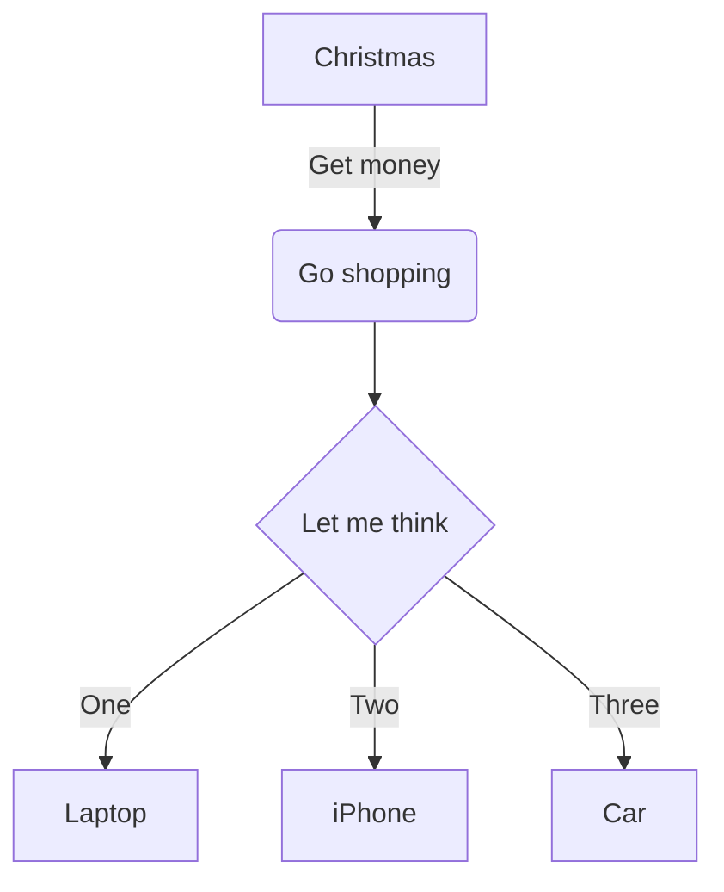

# Test Document

This is a test document with various markdown elements.

## Section with Table

Here's a table:

| Name | Age | City |
|------|-----|------|
| John | 30  | New York |
| Jane | 25  | London |

## Section with Lists

An ordered list:
1. First item
2. Second item
3. Third item

An unordered list:
- Item A
- Item B
- Item C

## Section with Code

```python
def hello():
    print("Hello, World!")
```

## Section with Mermaid Graph

